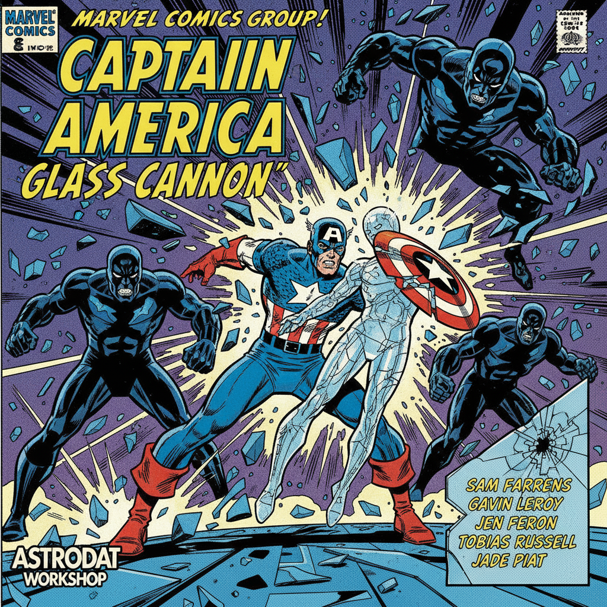

.. Glass Cannon documentation master file, created by
   sphinx-quickstart on Thu Sep 11 10:54:23 2025.
   You can adapt this file completely to your liking, but it should at least
   contain the root `toctree` directive.

Glass Cannon documentation
==========================

Glass Cannon is a lightweight toolkit built on GLASS and CAMB for generating
lognormal matter fields, computing angular power spectra, and simulating
biased tracers (e.g., galaxies, HI) across redshift shells. It provides a
simple pipeline and small utilities to help prototype large-scale structure
simulations and visualisations.

.. toctree::
   :maxdepth: 2
   :caption: Contents:
   
   modules

